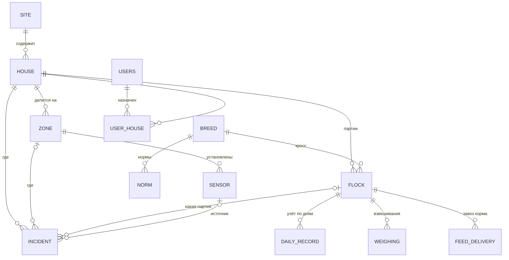

# S1-02. Модель данных производственного цикла

Статус: **черновик для утверждения** (issue #2). Реализация миграциями — S2-01.

## 1. ER-диаграмма

Телеметрия хранится в InfluxDB (measurement `sensor_reading`, теги `sensor_code`, `type`, `house_id`, `zone_id`), в Postgres — только справочник датчиков.

## 2. Сущности и поля

### site — площадка
| Поле | Тип | Обяз. | Описание |
|------|-----|:----:|----------|
| id | uuid | да | |
| code | varchar(32) | да | уникальный, например `FARM-1` |
| name | varchar(255) | да | «Площадка №1» |
| address | text | | |
| timezone | varchar(64) | да | `Europe/Samara`; возраст партии и сутки считаются по нему |

### house — птичник
| Поле | Тип | Обяз. | Описание |
|------|-----|:----:|----------|
| id | uuid | да | |
| site_id | uuid → site | да | |
| code | varchar(32) | да | уникальный в площадке, `1-04` |
| name | varchar(255) | да | |
| area_m2 | numeric(8,1) | | для плотности посадки |
| capacity_heads | int | | максимальное поголовье |
| active | boolean | да | |

### zone — зона птичника
| Поле | Тип | Обяз. | Описание |
|------|-----|:----:|----------|
| id | uuid | да | |
| house_id | uuid → house | да | |
| code | varchar(32) | да | `Z1`… |
| name | varchar(255) | да | «Зона посадки», «Торец у вентиляторов» |
| layout | jsonb | | координаты на схеме птичника (S5-03) |

### breed — кросс
| Поле | Тип | Обяз. | Описание |
|------|-----|:----:|----------|
| code | varchar(32) PK | да | `ROSS_308`, `COBB_500` |
| name | varchar(255) | да | |

### flock — партия (цикл выращивания)
| Поле | Тип | Обяз. | Описание |
|------|-----|:----:|----------|
| id | uuid | да | |
| house_id | uuid → house | да | в птичнике одновременно не больше одной активной партии |
| code | varchar(32) | да | `2026-10-1-04` |
| breed_code | → breed | да | |
| placed_at | date | да | дата посадки, день 0 |
| placed_heads | int | да | поголовье при посадке |
| placed_avg_weight_g | numeric(6,1) | | вес суточного цыплёнка, ≈ 40 г |
| sex | varchar(16) | | `MIXED`, `MALE`, `FEMALE` |
| hatchery | varchar(255) | | инкубаторий / поставщик |
| target_age_days | int | | плановый срок убоя |
| status | varchar(16) | да | `PLANNED`, `ACTIVE`, `CLOSED` |
| closed_at | date | | дата убоя / вывоза |
| shipped_heads | int | | сдано голов |
| shipped_live_weight_kg | numeric(10,1) | | сдано живого веса |

Возраст партии в днях = `текущая дата (в timezone площадки) − placed_at`.

### daily_record — ежедневный учёт по партии
| Поле | Тип | Обяз. | Описание |
|------|-----|:----:|----------|
| id | uuid | да | |
| flock_id | uuid → flock | да | |
| record_date | date | да | уникально в паре с flock_id |
| mortality_heads | int | да | падёж за сутки |
| culled_heads | int | да | выбраковка за сутки |
| feed_consumed_kg | numeric(10,1) | | расход корма за сутки |
| water_consumed_l | numeric(10,1) | | расход воды за сутки |
| comment | text | | |
| created_by, updated_by | uuid → users | да | |
| created_at, updated_at | timestamptz | да | история правок — в журнале действий (S2-06) |

### weighing — контрольное взвешивание
| Поле | Тип | Обяз. | Описание |
|------|-----|:----:|----------|
| id | uuid | да | |
| flock_id | uuid → flock | да | |
| zone_id | uuid → zone | | |
| weighed_at | timestamptz | да | |
| sample_heads | int | да | сколько птиц взвесили |
| avg_weight_g | numeric(7,1) | да | |
| uniformity_pct | numeric(5,2) | | доля птиц в ±10% от среднего |
| method | varchar(16) | да | `MANUAL`, `SCALE` (автовесы), позже `VIDEO` |

### feed_delivery — завоз корма (для FCR по факту склада)
| Поле | Тип | Обяз. | Описание |
|------|-----|:----:|----------|
| id | uuid | да | |
| flock_id | uuid → flock | да | |
| delivered_at | date | да | |
| feed_type | varchar(32) | да | `PRESTARTER`, `STARTER`, `GROWER`, `FINISHER` |
| amount_kg | numeric(10,1) | да | |

### sensor — датчик (есть, дополняется)
Существующая таблица `sensors` получает `house_id`, `zone_id` (S2-07), чтобы датчик менял зону без правки кода.

### norm — норма по возрасту (S3-01)
| Поле | Тип | Обяз. | Описание |
|------|-----|:----:|----------|
| id | uuid | да | |
| breed_code | → breed, nullable | | null = норма для всех кроссов |
| metric | varchar(32) | да | `TEMPERATURE`, `HUMIDITY`, `CO2`, `AMMONIA`, `LIGHT_INTENSITY`, `LIGHT_HOURS`, `BODY_WEIGHT`, `FEED_INTAKE`, `WATER_INTAKE`, `MORTALITY` |
| age_from_day, age_to_day | int | да | интервал возраста |
| min_value, target_value, max_value | numeric | | границы нормы |
| unit | varchar(16) | да | |
| version | int | да | версия справочника |
| source | text | да | ссылка на руководство кросса или решение технолога |

### incident (есть, дополняется)
Добавить `house_id`, `zone_id`, `flock_id`, `sensor_id`, `rule_code` вместо текстовых `workshop`/`house`/`zone`. Текстовые поля остаются до миграции фронта.

### users (есть) и user_house
`user_house(user_id, house_id)` — назначение пользователя на птичники (S2-05).

## 3. Правила целостности

- В птичнике одна партия в статусе `ACTIVE` (частичный уникальный индекс по `house_id where status='ACTIVE'`).
- `daily_record.record_date` между `placed_at` и `closed_at` партии.
- Поголовье на дату = `placed_heads − Σ(mortality + culled)` до этой даты; не может быть отрицательным.
- Закрытая партия правится только ролью TECHNOLOGIST или ADMIN, с записью в журнале.

## 4. Вопросы для утверждения

1. Нужен ли учёт по зонам для падежа или достаточно партии целиком.
2. Ведётся ли раздельное выращивание по полу (влияет на нормы и KPI).
3. Источник данных о корме: суточный расход с датчиков бункера, завоз или оба (FCR считается по выбранному правилу, см. S1-04).
