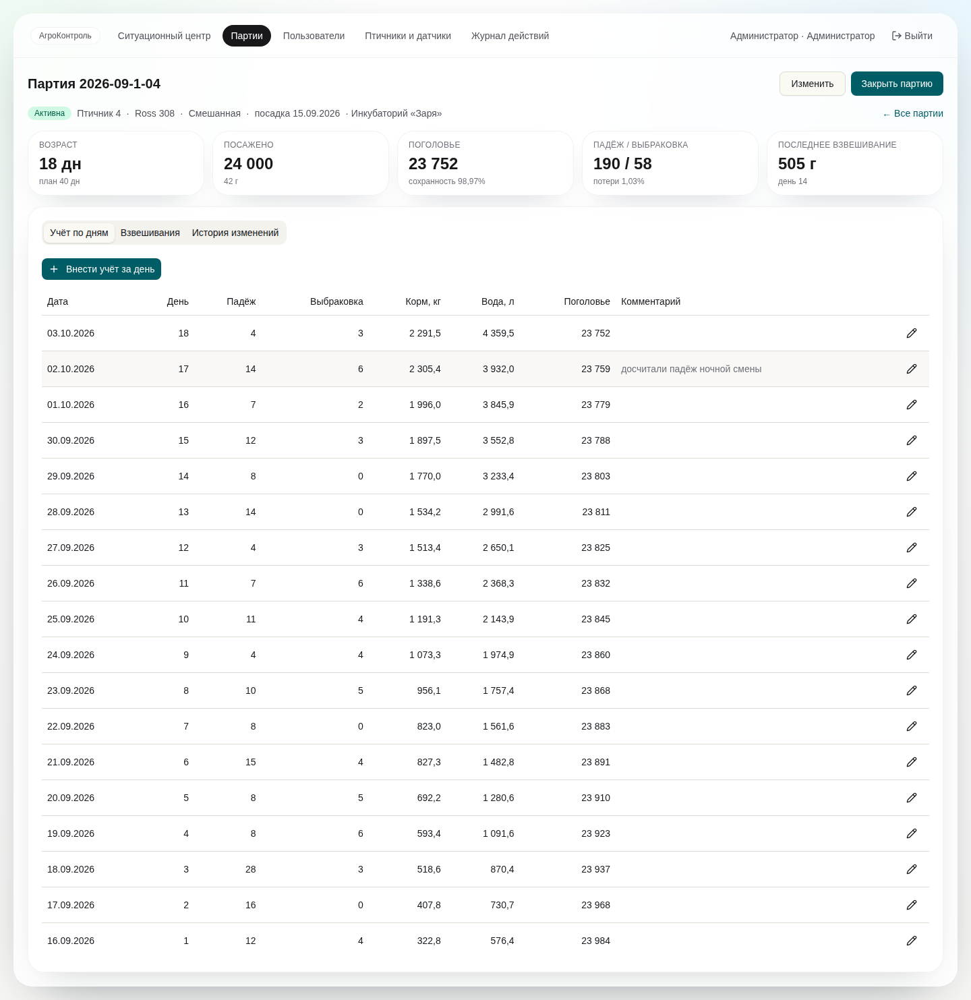
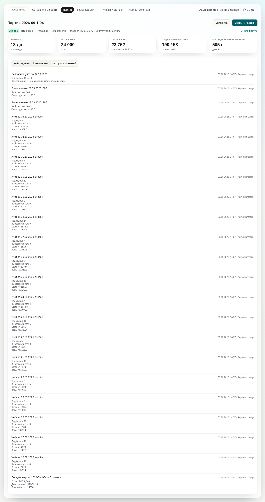
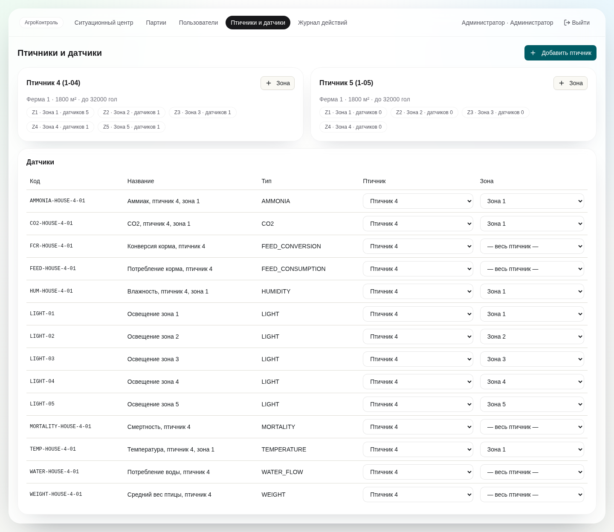
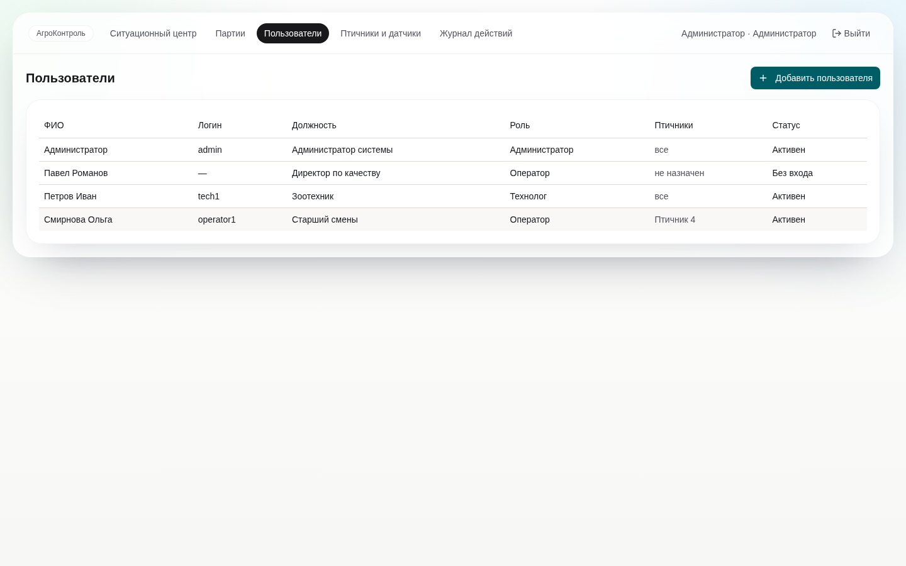

# S2-10. Макеты: главная по партии, экран партии, карта птичника

Статус: **черновик для согласования** (issue #28). Экран партии уже реализован — его снимки ниже служат макетом. Главная по партии (S4-03) и карта птичника (S5-03) — схемы, по ним делается вёрстка.

## 1. Экран партии (реализовано, S2-02/S2-03)



- Шапка: статус, птичник, кросс, пол, дата посадки, инкубаторий; кнопки «Изменить» и «Закрыть партию» (технолог, админ).
- Плитки: возраст (план), посажено, поголовье и сохранность, падёж/выбраковка и потери, последнее взвешивание.
- Вкладки: учёт по дням (правка любой строки → журнал), взвешивания, история изменений.
- В S4-04 добавляется вкладка «KPI и план-факт»: графики веса и FCR против нормы кросса.



## 2. Главная по партии (S4-03)

```
┌───────────────────────────────────────────────────────────────────────────────┐
│ Птичник [4 ▾]  Партия 2026-09-1-04 · Ross 308 · день 18 из 40     ● 2 инцидента │
├───────────────┬───────────────────────────────────────────────────────────────┤
│ Категории     │ KPI партии                                                     │
│ ● Микроклимат │ ┌─────────┬─────────┬─────────┬─────────┬─────────┐            │
│ ● Освещение   │ │Сохран.  │ FCR     │ Привес  │ Вес     │ EPEF    │            │
│ ● Производство│ │98,97 %  │ 1,21    │ 52 г/сут│ 505 г   │ —       │            │
│ ● Ресурсы     │ │норма ≥97│ норма   │         │ −3 % к  │         │            │
│ ● Стадо       │ │         │ 1,05    │         │ норме   │         │            │
│               │ └─────────┴─────────┴─────────┴─────────┴─────────┘            │
│ цвет = статус │ Показатели категории: значение · норма для дня 18 · график 24 ч │
│ из движка     │ Температура 24,1 °C · норма 23,0 ± 1,0 · ▁▂▃▅▆▇ (жёлтая)        │
│ правил        │ Влажность 58 % · норма 50–60 · ▃▃▃▄▃▃                           │
└───────────────┴───────────────────────────────────────────────────────────────┘
```

Источник всех чисел — API (`/flocks/{id}/kpi`, `/houses/{id}/status`, телеметрия), захардкоженных значений нет. Нормы показываются для возраста выбранной партии.

## 3. Карта птичника с зонами (S5-03)

```
┌──────────────────────────── Птичник 4 ─────────────────────────────┐
│  Z1          │  Z2          │  Z3          │  Z4          │  Z5     │
│  24,1 °C     │  24,3 °C     │  26,8 °C ⚠   │  24,0 °C     │ 23,8 °C │
│  CO2 1800    │              │  NH3 14 ppm  │              │         │
│  ● норма     │  ● норма     │  ● инцидент  │  ● норма     │ ● норма │
└──────────────┴──────────────┴──────────────┴──────────────┴─────────┘
   вход                                                    вентиляторы
```

- Зоны рисуются по `zones.layout` (проценты ширины/высоты), админ задаёт их в «Птичники и датчики».
- Зона с открытым инцидентом подсвечивается цветом приоритета; клик открывает список инцидентов зоны.
- Значения — последние показания датчиков зоны.

## 4. Администрирование (реализовано)




## Вопросы на согласование

1. Достаточно ли на главной одной выбранной партии или нужен режим «все птичники сразу» (это сводка руководителя, S5-05).
2. Где на карте показывать задачи по инцидентам.
