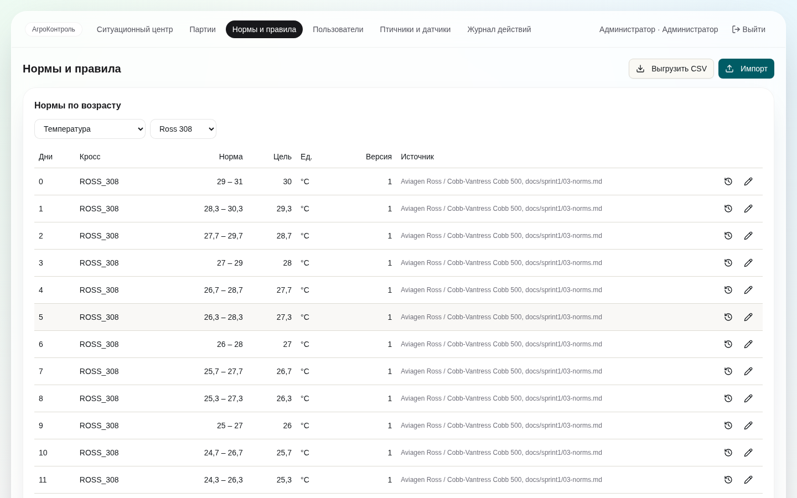
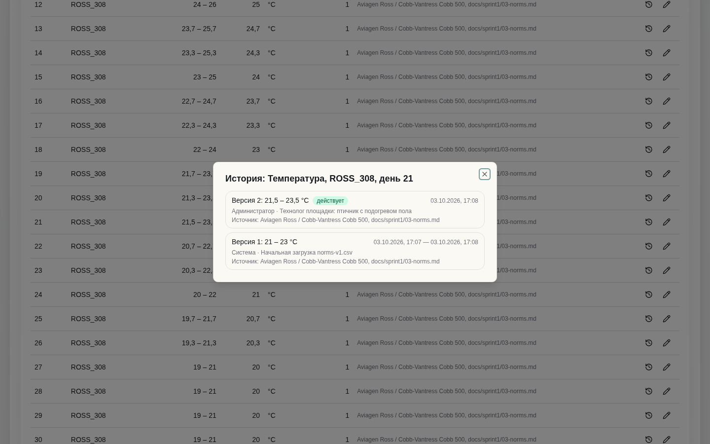
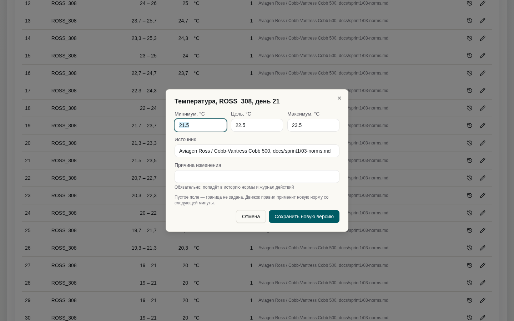
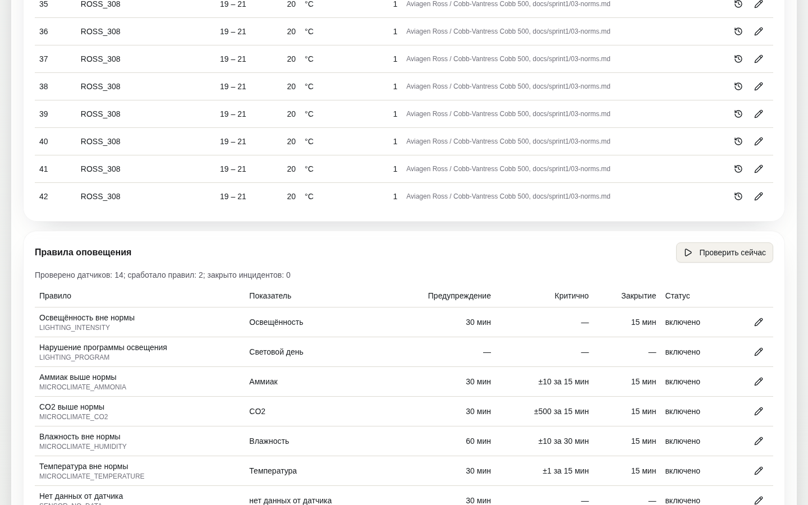
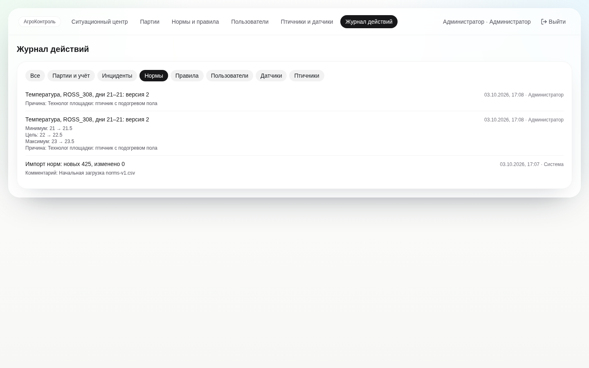
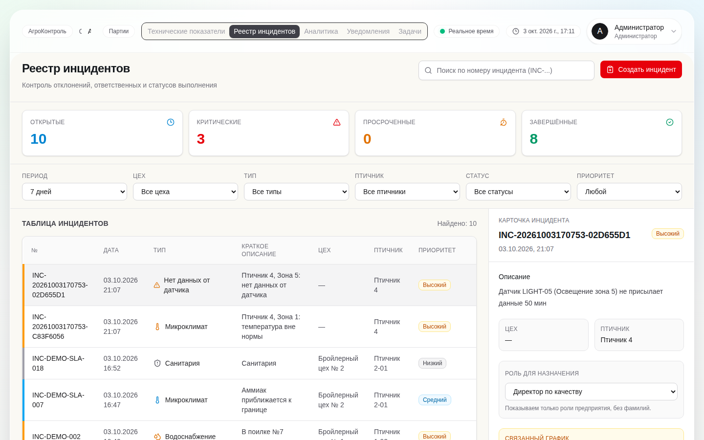

# Спринт 3 «Нормы и правила» (2–13 ноября 2026)

| Задача | Где | Issue |
|--------|-----|-------|
| S3-01 Справочник норм: модель, API, импорт таблицы норм спринтов 1–2 | `V21__norms_and_rules.sql`, `norms/norms-v1.csv` (425 строк), `NormService`, `/api/v1/norms` | #31 |
| S3-02 Редактор норм с версионированием | экран «Нормы и правила» (`/norms`): правка → новая версия, история версий, импорт/выгрузка CSV, журнал | #32 |
| S3-03 Движок правил по нормам с учётом возраста партии, длительности и приоритета | `rules/RuleEngine` (чистая логика), `RuleEvaluationService` (цикл раз в минуту), `RuleEngineTest` | #33 |
| S3-04 Дедупликация и автозакрытие | `IncidentAutomationService`, `incidents.dedup_key` | #34 |
| S3-05 Освещение через общий движок, без констант 25–40 лк | правила `LIGHTING_INTENSITY`, `LIGHTING_PROGRAM`; `LightingMonitoringService` считает только равномерность | #35 |
| S3-06 Микроклимат: температура, влажность, CO2, аммиак | правила `MICROCLIMATE_*` | #36 |
| S3-07 Потеря данных | правило `SENSOR_NO_DATA` | #37 |
| S3-08 Эталонные партии для проверки KPI | [08-kpi-reference.md](08-kpi-reference.md), `kpi/KpiFormulas`, `KpiFormulasTest` | #38 |
| S3-09 Генератор цикла 42 дня | `sensorImitation/cycle_generator.py`, [09-cycle-generator.md](09-cycle-generator.md) | #39 |
| S3-10 Подготовка пилота и аудит | [10-pilot-preparation.md](10-pilot-preparation.md) — план; сам аудит проводят люди на площадке | #40 |
| S3-11 Тестирование правил и норм | [11-test-report.md](11-test-report.md) | #41 |
| S3-12 Истории спринта 4 | [12-sprint4-stories.md](12-sprint4-stories.md) | #42 |
| S3-13 Требования к отчёту по партии и сводке руководителя | [13-report-requirements.md](13-report-requirements.md) | #43 |

## Как работает движок правил

1. Раз в минуту (`RULES_EVALUATION_INTERVAL_MS`) для каждого активного датчика, привязанного к птичнику, берётся активная партия птичника: кросс и возраст в днях по часовому поясу площадки.
2. Для каждого включённого правила с типом датчика находится действующая норма `(показатель, кросс, возраст)`; норма кросса важнее общей.
3. Показания за окно правила читаются из InfluxDB. Показание действует до следующего (sample-and-hold), поэтому редкие показания не теряются.
4. Уровень: **CRITICAL** — всё окно `critical_minutes` за границей больше чем на `critical_delta`; **WARNING** — всё окно `warn_minutes` вне нормы; **NORMAL** — всё окно `clear_minutes` в норме; иначе без изменений. Данные старше 30 минут уровень не меняют.
5. Ключ дедупликации `правило:датчик`. Открытый инцидент по ключу не дублируется, при росте до CRITICAL его приоритет повышается. Возврат в норму закрывает инцидент в статусе OPEN (RESOLVED); инцидент IN_PROGRESS остаётся у человека, в историю пишется отметка «в норме с HH:MM».
6. Нет активной партии — проверяется только «нет данных». Для освещённости показания ниже 1 лк считаются тёмным периодом и не проверяются.
7. Программа освещения — раз в час: часы света за последние 24 часа (по датчикам освещённости птичника, разрывы связи > 60 мин не учитываются, нужно покрытие ≥ 20 ч) против нормы `LIGHT_HOURS`; выход за норму — WARNING, больше чем на 2 ч — CRITICAL. Результат также пишется в Influx `lighting_schedule_compliance` с кодом птичника.

Пороги правил и нормы — данные: правка на экране «Нормы и правила» применяется со следующего цикла без перезапуска и пишется в журнал действий. Кнопка «Проверить сейчас» (`POST /api/v1/rules/evaluate`) запускает внеочередной цикл.

## Снимки экранов

