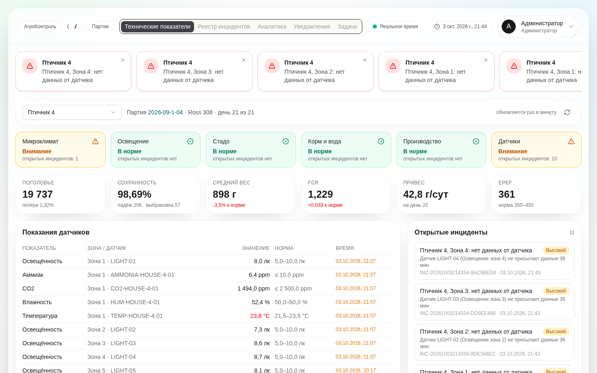
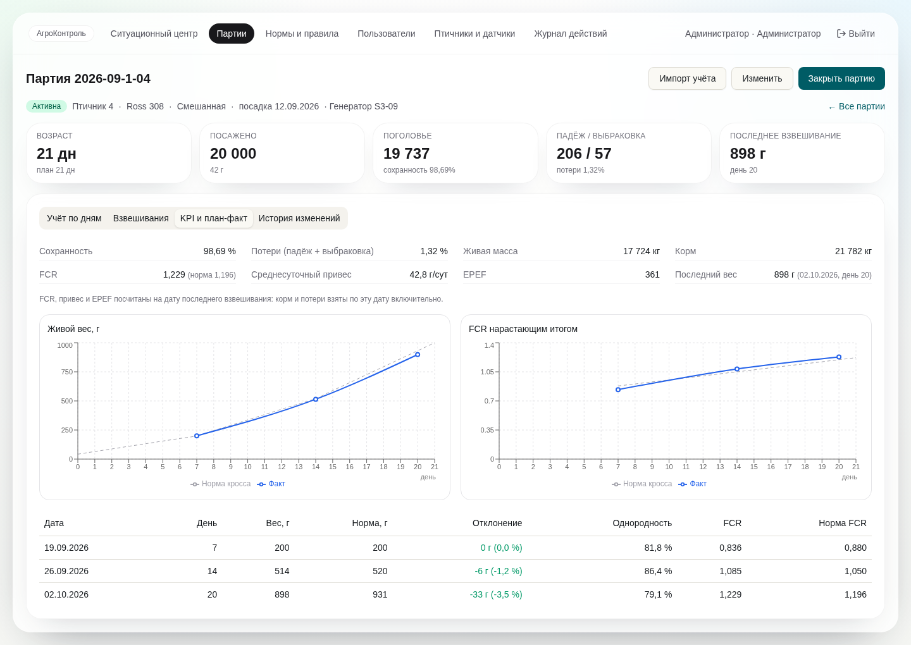
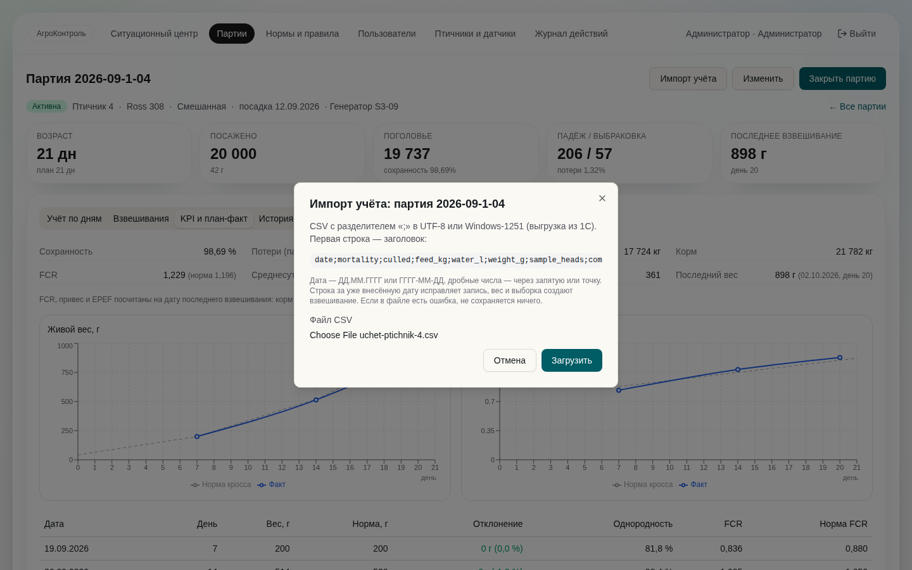
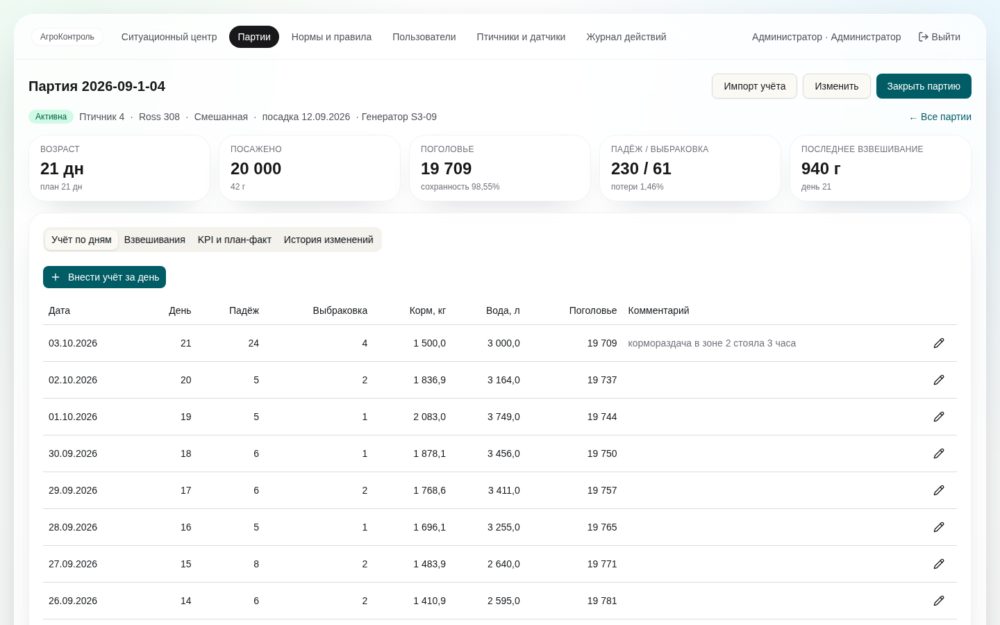
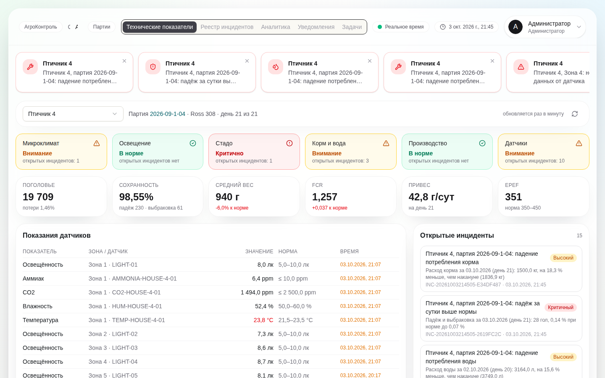
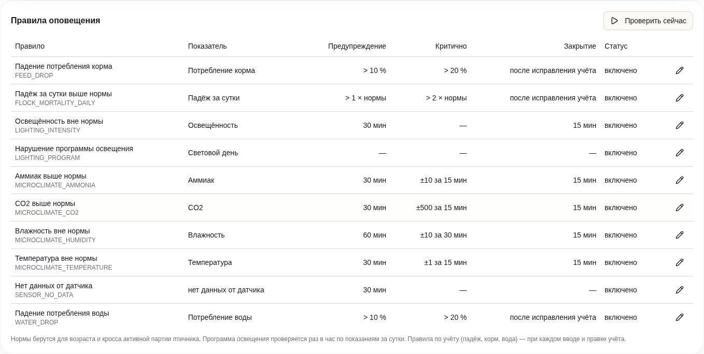
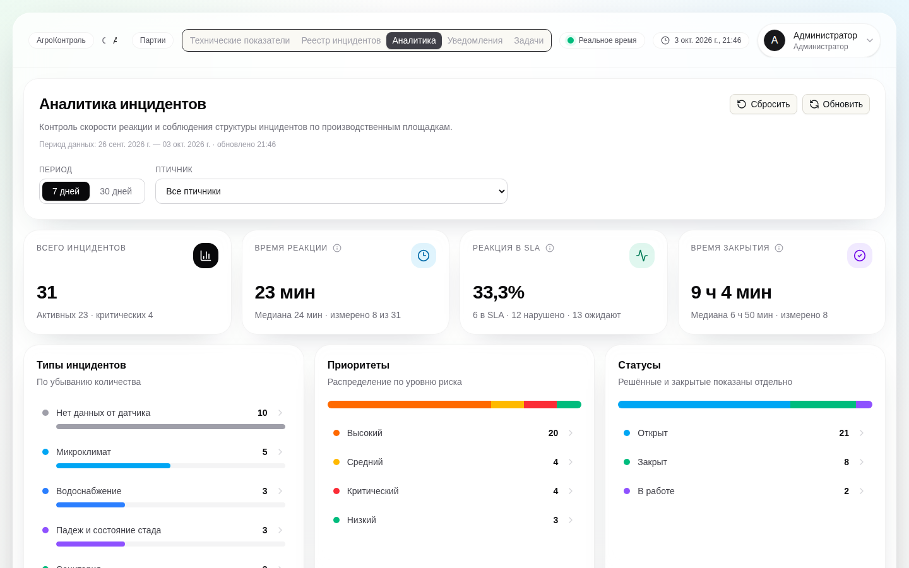
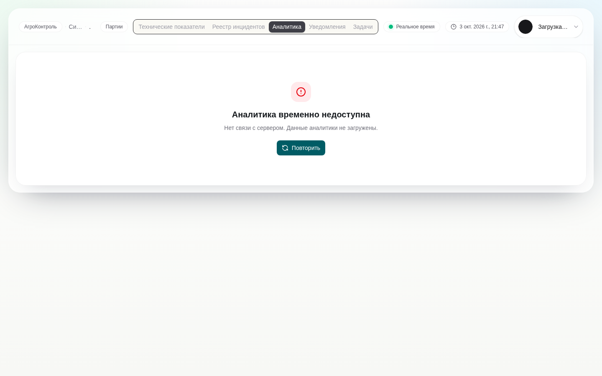

# Спринт 4 «KPI и реальные данные» (16–27 ноября 2026)

| Задача | Где | Issue |
|--------|-----|-------|
| S4-01 Расчёт KPI партии | `kpi/KpiService`, `GET /api/v1/flocks/{id}/kpi`, `KpiIntegrationTest` | #44 |
| S4-02 План-факт по кривой кросса | `GET /api/v1/flocks/{id}/plan-fact` | #45 |
| S4-03 Главная на реальных данных | `components/overview/flock-overview.tsx`; удалены `dashboard-data.ts`, `kpi-grid`, `detail-panel`, `production-filters`, `metricks-detail`, `lighting-metrics` | #46 |
| S4-04 Экран партии: KPI и план-факт | вкладка «KPI и план-факт» (`components/flocks/kpi-plan-fact.tsx`) | #47 |
| S4-05 Правила корма, воды и падежа | `rules/FlockRecordRuleService`, миграция `V22`, `FlockRecordRulesIntegrationTest` | #48 |
| S4-06 MQTT-шлюз | `integration/mqtt/MqttTelemetryAdapter`, Mosquitto в `deploy.yml` (профиль `mqtt`), `MqttTelemetryAdapterIntegrationTest` | #49 |
| S4-07 Импорт учёта из CSV / 1С | `service/FlockImportService`, `POST /api/v1/flocks/{id}/import`, кнопка «Импорт учёта», [пример файла](examples/uchet-ptichnik-4.csv) | #50 |
| S4-08 Аналитика без мок-фолбэка | `app/api/incidents/analytics/route.ts` отвечает 503 «Нет связи с сервером»; исправлена ошибка `Unexpected token '<'` | #51 |
| S4-09 Сценарии подключения пилота | [09-connection-scenarios.md](09-connection-scenarios.md) — черновик; карта датчиков — после аудита | #52 |
| S4-10 Требования к оповещениям | [10-notification-requirements.md](10-notification-requirements.md) — на утверждение | #53 |
| S4-11 Тестирование KPI и импорта | [11-test-report.md](11-test-report.md) | #54 |
| S4-12 Истории спринта 5 | [12-sprint5-stories.md](12-sprint5-stories.md) | #55 |
| S4-13 Реальные данные учёта пилота | нужно от площадки: выгрузка за 1–2 закрытые партии по шаблону S2-09 | #56 |
| S4-14 Тестирование ролей и журнала | [11-test-report.md](11-test-report.md), раздел «Роли и журнал» | #57 |

Плюс исправлен дефект 1 из отчёта спринта 3: время инцидентов и время реакции больше не «уезжают» на 4 часа на сервере в UTC.

## KPI партии

Формулы — [S1-04](../sprint1/04-kpi-formulas.md), реализация — `KpiFormulas` (проверена на 8 эталонах S3-08).

- **Поголовье, сохранность, потери** — на сегодня; у закрытой партии — по сдаче. Если при сдаче голов меньше, чем живых по учёту, разница показывается строкой «Не учтено при сдаче» (ответ на вопрос из S3-08).
- **Живая масса, FCR, привес, EPEF** — на дату последнего взвешивания: корм, падёж и выбраковка берутся по эту дату включительно, чтобы корм за дни после взвешивания не завышал FCR. У закрытой партии — на сдачу (средний вес = живой вес / сдано голов).
- **Отклонение от нормы** — вес и FCR против нормы кросса на возраст взвешивания из справочника норм.
- Нет взвешиваний — масса, FCR, привес и EPEF не считаются («—»), а не ноль. Сутки без данных по корму считаются и показываются: FCR неполный.

## Правила по учёту (S4-05)

Проверяются при каждом вводе, правке, удалении записи учёта и при импорте — тем же механизмом инцидентов, что и правила датчиков (дедупликация, повышение до CRITICAL, автозакрытие).

| Правило | Условие | Порог по умолчанию |
|---------|---------|--------------------|
| `FLOCK_MORTALITY_DAILY` | (падёж + выбраковка) / поголовье на начало суток против нормы падежа дня | выше нормы — HIGH, выше двух норм — CRITICAL |
| `FEED_DROP` | расход корма к прошлым суткам | падение > 10 % — HIGH, > 20 % — CRITICAL |
| `WATER_DROP` | расход воды к прошлым суткам | падение > 10 % — HIGH, > 20 % — CRITICAL |

Ключ дедупликации — правило + партия + дата. Исправили учёт так, что показатель в норме — инцидент закрывается («Учёт исправлен, показатель в норме»), если его ещё не взяли в работу. Пороги правятся на экране «Нормы и правила».

## Главная (S4-03)

Птичник выбирается в списке (запоминается в браузере), партия — активная партия птичника. Плитки категорий окрашиваются по открытым инцидентам: красная — есть CRITICAL, жёлтая — HIGH или MEDIUM, зелёная — нет. Дальше KPI партии, последние показания датчиков против нормы на возраст и список открытых инцидентов. Данные обновляются раз в минуту. Пустая база — понятные сообщения («Птичники ещё не заведены», «В птичнике нет активной партии»), а не выдуманные цифры.

## Импорт учёта (S4-07)

Формат — [S2-09 п. 3](../sprint2/09-integration-protocol.md). UTF-8 или Windows-1251 определяется сам, дата `ДД.ММ.ГГГГ` или `ГГГГ-ММ-ДД`, дробные через запятую или точку. Строка за уже внесённую дату исправляет запись (правка в журнале действий), вес и выборка создают взвешивание (повтор не дублирует). Файл проверяется целиком: если есть ошибки, ничего не сохраняется, ответ перечисляет строки с причинами. Импорт делают технолог и администратор.

## MQTT-шлюз (S4-06)

Включается `MQTT_ENABLED=true`. Брокер Mosquitto поднимается профилем: `docker compose -f deploy.yml --profile mqtt up -d`; логины шлюзов — в `deploy/mosquitto/passwd` (команда в `deploy/mosquitto/mosquitto.conf`). Для разработки — `docker compose --profile mqtt up -d mosquitto` в `backend/broiler_monitoring` (без пароля).

Топик `broiler/<площадка>/<птичник>/<код датчика>`, сообщение — JSON `{"type","value","unit","measuredAt"}` или просто число. Показания копятся до 200 штук или 5 секунд и сохраняются тем же приёмом, что и HTTP. Неизвестный или выключенный датчик и чужой тип отбрасываются с записью в лог, остальная пачка сохраняется. Потеря брокера не роняет backend, адаптер переподключается сам.

## Часовой пояс

Время инцидентов, задач и истории хранится без пояса (`LocalDateTime`). Раньше часы правил жили по Самаре, а сущности — по поясу сервера, и время реакции на сервере в UTC расходилось на 4 часа. Теперь backend при старте выставляет пояс `APP_TIMEZONE` (по умолчанию `Europe/Samara`) для всего процесса. **При переходе:** инциденты, созданные раньше на сервере в UTC, остаются в UTC — на пилоте рабочих данных ещё нет, переносить нечего.

## Снимки экранов

| | |
|---|---|
|  |  |
| Главная: категории, KPI, датчики, инциденты | Экран партии: KPI и план-факт |
|  |  |
| Импорт файла учёта | Учёт после импорта |
|  |  |
| После импорта: «Стадо» — критично, «Корм и вода» — внимание | Правила по учёту на экране «Нормы и правила» |
|  |  |
| Аналитика на данных backend | Backend остановлен: честное «Нет связи с сервером» |
